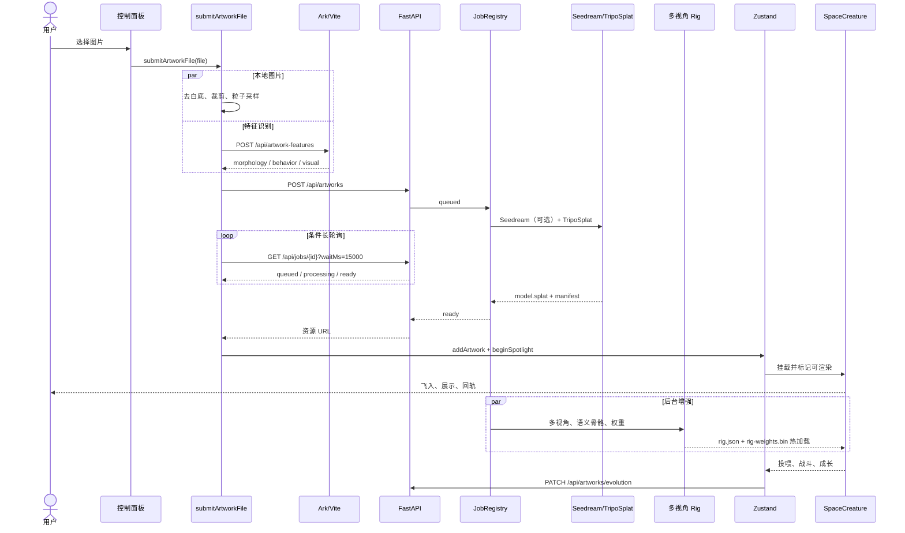

# AI Sketch Cosmos 完整使用流程与实现机制

本文按当前代码实现，完整说明一张画作从浏览器上传、特征识别、TripoSplat 生成、语义 Rig、进入星河、参与互动和成长，到后台管理与持久化的全过程。它既是用户操作说明，也是前后端联调、故障定位和二次开发的索引。

> 文档基于当前仓库代码，而不是理想化设计。具体数学原理见 [TripoSplat 原理深度解析](TRIPOSPLAT_PRINCIPLE.md)，GPU Rig 数据格式见 [单一 Splat GPU 骨骼蒙皮](GPU_SPLAT_SKINNING.md)，部署参数见 [部署指南](DEPLOYMENT.md)。

---

## 1. 项目目标与能力边界

AI Sketch Cosmos 把儿童画、插画或普通图片转换为“生活在同一片宇宙中”的 3D 粒子生物。系统由三个逐级增强的层次组成：

1. **浏览器本地粒子层**：去除边缘连通的白色背景，从原图采样颜色和轮廓，生成可以立即显示的图片粒子。
2. **TripoSplat 3D 层**：后端把单图重建为 `model.splat`，提供真正的三维位置、尺度、旋转、颜色和透明度。
3. **语义动作层**：后端分析手、脚、翅膀、尾巴等部位，为同一个 Splat 生成骨骼与权重；前端用 GPU 或兼容 CPU 路径驱动局部动作。

系统遵循“基础内容先显示、增强资源异步到达”的原则。AI 识别、Seedream、TripoSplat 或 Rig 任一环节失败，都不应轻易阻止作品进入星河。

### 1.1 各技术负责什么

| 子系统 | 主要职责 | 不负责的内容 |
|---|---|---|
| React + DOM | 上传面板、状态文字、后台管理、全屏和文件选择 | 3D 粒子逐帧运动 |
| React Three Fiber + Three.js | 星河、相机、生物、粒子、行星、传送门和事件渲染 | 单图生成 3D 模型 |
| 火山方舟视觉模型 | 识别主体、形态、颜色、行为和适合运动的部位 | 直接输出 `.splat` |
| Seedream | 可选生成更适合单图重建的参考图 | 星河玩法和运行时动画 |
| TripoSplat | 从单图生成 Gaussian Splat | 战斗、成长、投喂和局部动作状态机 |
| 语义 Rig 管线 | 多视角渲染、部位分析、骨骼和权重生成 | 替换原始模型外观 |
| FastAPI + SQLite | 任务、资源、作品元数据和成长记录持久化 | 浏览器中的每帧动画 |
| Zustand | 前端作品、上传、聚光、食物、事件和成长状态协调 | 后端文件持久化 |

---

## 2. 用户能看到和操作的完整流程

### 2.1 首次进入主页

1. `App` 检查 URL；只有路径严格为 `/admin` 时才进入管理后台，其他路径加载星河主页。
2. 主页创建 WebGL 画布、相机、轻量天空和控制面板。
3. 如果配置了后端地址，前端分页读取全部有效历史作品并写入 `useArtworkStore`。
4. 后端返回的成长记录同步到 `useCreatureEvolutionStore`，随后启动成长状态持久化监听。
5. `OrbitArtwork` 首批只挂载 2 件历史作品，之后每约 560 ms 增加一件，避免同时解析大量 `.splat`。
6. 背景也分阶段加入：天空立即出现，深空星点约 200 ms、闪烁星约 600 ms、银河约 800 ms、星云约 1500 ms、丝带星云约 2500 ms、行星约 2800 ms、前景散景约 3000 ms 后挂载。

### 2.2 发布一件作品

1. 点击“发布作品”或“发射作品”。生成期间按钮禁用，避免同一面板重复提交。
2. 普通模式使用隐藏的 `<input type="file" accept="image/*">`；在浏览器全屏并支持 File System Access API 时优先使用 `showOpenFilePicker`，减少退出全屏。
3. `submitArtworkFile` 判断 TripoSplat 是否启用：
   - 未启用：本地图片处理和 AI 特征识别并行完成，直接加入图片粒子作品。
   - 已启用：本地图片处理先启动，AI 特征识别异步启动，随后提交 TripoSplat 后端任务。
4. 控制面板持续显示当前阶段，例如本地去白底、提交任务、GPU 排队、生成进度、回退或完成。
5. 基础 `.splat` 完成后立即写入作品状态并请求聚光入场；如果 AI 识别稍晚完成，会再更新行为特征，不阻塞基础模型显示。
6. 后端语义 Rig 可以继续在后台生成；前端轮询到 `rig.json` 后热加载局部动作。

### 2.3 聚光入场

新作品不是通过普通点击进入特写，而是由上传流程自动请求聚光。状态依次为：

```text
requested（已请求）
    ↓ 模型确认可渲染
pending / ready（等待当前作品结束）
    ↓
fly-in（飞入，1.6 s）
    ↓
showcase（近景展示，5.0 s）
    ↓
release（释放返回，3.0 s）
    ↓
settle（稳定回轨，1.2 s）
    ↓
idle
```

`SpotlightDirector` 只推进阶段；`CameraRig` 保存用户原视角并接管相机；`SpaceCreature` 负责作品飞入、停留、局部表演和回轨。多个作品连续上传时，`requestedCreatureId` 与 `pendingCreatureId` 形成串行队列，避免相机争抢。

### 2.4 玩家直接操作

| 操作 | 实际效果 | 互斥规则 |
|---|---|---|
| 拖动星河 | `TrackballControls` 允许旋转视角并暂停自动环绕 | 当前配置不开放平移和滚轮缩放 |
| 点击空闲生物 | 触发粒子爆散、流星头、消失和重生聚合 | 聚光或自动独占事件期间忽略 |
| 点击空白星空 | 在透明交互平面的世界坐标投放星光食物 | 生物命中具有更高优先级，不会同时投食 |
| 移动指针 | 更新 3D 指针坐标，附近生物产生轻微避让 | 离开平面后坐标清空 |
| 按住或拖动画布 | 以按压点为中心触发引力透镜、旋涡、冲击波和色差 | 控制面板事件不会触发坍缩 |
| 隐藏面板 | 切换为紧凑按钮，保留沉浸式画面 | 不影响星河状态 |
| 清空星河 | 清空当前浏览器作品与聚光状态 | 不删除 SQLite 和后端模型文件 |
| 全屏 | 进入或退出浏览器全屏 | 不支持时显示错误提示 |

### 2.5 自动生态

玩家不操作时，系统仍会周期性组织：星尘投喂、追逐、逃跑、碰撞、战斗、胜负、短时加速、行星吸入、挣扎、逃脱、传送门逃生、环境脉冲和自动坍缩。正在聚光的作品受到保护，不进入普通自动事件。

---

## 3. 运行拓扑与请求路径

### 3.1 完整开发拓扑

```text
浏览器
  │
  ├─ 页面、JS、纹理 ───────────────→ Vite（默认 127.0.0.1:5173）
  │
  ├─ POST /api/artwork-features ───→ Vite 中间件 ─→ 火山方舟 Responses API
  ├─ POST /api/ai-recognize ───────→ Vite 中间件 ─→ 火山方舟 Responses API
  ├─ /api/artwork-3d/* ────────────→ Vite 中间件 ─→ 火山方舟内容生成 API
  │
  └─ /triposplat/* ────────────────→ Vite 代理 ───→ FastAPI（默认 127.0.0.1:8000）
                                                   ├─ SQLite
                                                   ├─ backend/outputs
                                                   ├─ Seedream API
                                                   ├─ TripoSplat / CUDA
                                                   └─ 语义多视角 Rig
```

`VITE_TRIPOSPLAT_API_BASE` 可以配置成完整后端 URL，也可以配置成同源 `/triposplat`。`triposplatAssetUrl.ts` 会在浏览器 URL、后端相对 URL和本机回环 URL之间做归一化，避免公网访问者错误请求其自己电脑上的 `127.0.0.1`。

### 3.2 前端启动与构建

```bash
npm install
npm run dev
npm run build
npm run preview
```

`dev` 和 `preview` 都带有 Vite 自定义中间件，因此可使用 Ark 代理。只把 `dist/` 部署为纯静态站点时，不会自动拥有 `/api/artwork-features` 等服务端中间件。

---

## 4. 浏览器本地图片处理

入口是 `src/utils/artworkImage.ts` 的 `processArtworkImage(file)`。

### 4.1 解码与缩放

- 使用 `URL.createObjectURL` 加载用户文件，并在完成后释放 URL。
- 画布最长边限制为 1024，较小图片不放大。
- 保存原始名称、宽高、宽高比和处理后的 Data URL。

### 4.2 白底移除

当前阈值和保护策略：

- 白色阈值：RGB 三通道均大于 242。
- Alpha 有效阈值：20。
- 前景保护半径：3 像素。
- 从画布四边对候选白色像素做 flood fill，只删除“与边缘连通”的背景。

因此，主体内部封闭的白色眼睛、纹理或高光不会仅因接近白色就被全部删除。处理后按非透明像素包围盒裁剪，再送入粒子云生成器。

### 4.3 图片粒子备用数据

本地粒子保存归一化位置、深度扰动、RGBA、亮度等属性。它有三种用途：

1. TripoSplat 未启用时作为主作品。
2. TripoSplat 失败时作为回退。
3. `.splat` 爆散时作为视觉代理和流星粒子来源。

旧版 `imageSampling.ts` 仍为 `useSketchStore` 的轻量生物路径提供采样：采样画布为 180，按颜色、亮度、边缘强度和有效像素权重选点，并限制单件作品的粒子数量。

---

## 5. AI 特征识别

### 5.1 请求路径

`analyzeArtworkFeatures(file)` 先在浏览器提取主色，再把图片转为 Data URL，向 `POST /api/artwork-features` 发送 JSON。Vite 中间件读取 `ARK_API_KEY`，调用火山方舟 Responses API，默认模型为：

```text
doubao-seed-2-0-mini-260428
```

`VITE_ARTWORK_FEATURE_RECOGNITION=false` 可以关闭远程特征识别。旧版 `/api/ai-recognize` 和 `analyzeArtworkBehavior` 仍保留兼容路径；Ark 3D 内容生成兼容路由为 `/api/artwork-3d/tasks` 与 `/api/artwork-3d/model`。

### 5.2 结构化结果

`ArtworkFeatureResult` 包括：

- `subjectCategory`：动物、植物、角色、抽象或物体。
- `morphology`：翅膀、腿、尾巴、鳍、耳朵、手臂、身体朝向、复杂度以及部位数量。
- `behaviorTraits`：运动方式、能量等级和性格感觉。
- `visualTraits`：主色列表、亮度、柔和度和纹理风格。
- `motionParts`：适合局部运动的头、耳、左右手臂、腿、尾巴、翅膀、鳍或身体。
- `motionPreset`：由识别结果归一化得到的运动预设。

所有枚举、颜色和部位都会在客户端再次校验。无效值被替换为中性默认值；识别失败则根据本地图像主色生成 `quickFallbackFeatures`，保证 3D 任务和入场可以继续。

### 5.3 特征如何影响运动

`artworkStore.ts` 把识别特征转换成 `CreatureBehaviorSignature`：能量、流动性、浮力、光泽、拖尾长度、粒子扩散和随机性。`creatureMotion.ts` 再用它调整：

- `fly / hop / swim / run / walk / crawl / float` 的速度与轨道范围；
- 呼吸、摇摆、滚转、流动强度和拖尾；
- `drift`、`hover`、`shimmer`、`breathe`、跳跃、冲刺等动作选择；
- 每约 4.6 秒的动作片段和基于作品相位的稳定随机选择。

---

## 6. TripoSplat 前端任务流程

### 6.1 启用条件

只有同时满足以下条件才启用后端 3D 生成：

```text
VITE_TRIPOSPLAT_ENABLED=true
VITE_TRIPOSPLAT_API_BASE 非空
```

### 6.2 创建任务

前端向 `POST /api/artworks` 提交 `multipart/form-data`：

| 字段 | 默认值 | 说明 |
|---|---:|---|
| `image` | 必填 | 用户原图 |
| `numGaussians` | 65536 | 后端允许 4096～262144 |
| `format` | `splat` | `splat`、`ply` 或 `both` |
| `features` | 可选 | JSON 字符串形式的识别特征 |

后端未就绪返回 503；格式或 Gaussian 数量不合法返回 400。

### 6.3 长轮询

创建成功后返回 `jobId`、`artworkId` 和初始状态。前端轮询：

```text
GET /api/jobs/{jobId}
    ?waitMs=15000
    &lastStatus=...
    &lastProgress=...
```

- 后端最多挂起 15 秒，状态或进度变化时立即返回。
- 后端允许的 `waitMs` 上限是 30000 ms。
- 如果旧后端没有真正长轮询并在 500 ms 内返回相同状态，前端额外等待 1000 ms，避免高频空转。
- 前端整体等待上限为 10 分钟。
- 状态为 `ready` 且存在 `.splat` 或 `.ply` URL 时完成；`failed`、HTTP 错误或超时进入本地粒子回退。

### 6.4 任务状态

| 状态 | 含义 |
|---|---|
| `queued` | 已注册，等待线程池 |
| `processing` | Seedream、TripoSplat、导出或保存正在执行 |
| `ready` | 基础模型资源已发布；Rig 可能仍在后台 |
| `failed` | 主生成任务失败，错误写入响应 |

`JobRegistry` 使用最多 2 个工作线程、条件变量和内存任务表。服务重启后内存任务状态不会恢复，但已完成作品由 SQLite 和输出目录继续提供。

---

## 7. FastAPI 接口完整说明

| 方法与路径 | 参数/请求体 | 返回与作用 |
|---|---|---|
| `GET /health` | 无 | `{ok: true}` |
| `GET /health/triposplat` | 无 | 权重、设备和可用性检查 |
| `GET /api/artworks` | `limit=50`（1～500）、`offset=0`、`status=active|deleted|all` | 作品列表；总数在 `X-Total-Count` |
| `GET /api/artworks/{id}` | 路径 ID | 单条作品，未找到为 404 |
| `POST /api/artworks` | 图片、数量、格式、特征 | 创建异步生成任务 |
| `GET /api/jobs/{jobId}` | `waitMs`、`lastStatus`、`lastProgress` | 普通查询或条件长轮询 |
| `PATCH /api/artworks/{id}/metadata` | 名称、尺寸、宽高比、特征、Gaussian 元数据 | 更新管理信息 |
| `PATCH /api/artworks/evolution` | `{records: [...]}` | 批量持久化成长记录 |
| `DELETE /api/artworks/{id}` | 无 | 软删除，不删模型文件 |
| `POST /api/artworks/{id}/restore` | 无 | 恢复软删除记录 |
| `DELETE /api/artworks/{id}/permanent` | 无 | 删除数据库记录和作品目录 |

FastAPI 启动时会初始化数据库，并扫描已有输出目录回填缺失记录，兼容升级前已生成但未入库的作品。

---

## 8. 后端生成管线

### 8.1 作品目录与原图

`POST /api/artworks` 创建唯一 `artworkId` 和目录，保留上传文件扩展名并保存源图。任务记录保存创建时间、开始时间、进度、消息、错误和最终资源。

### 8.2 Seedream 参考图

Seedream 默认启用，默认模型为 `doubao-seedream-4-5-251128`：

1. Pillow 读取源图，最长边按 `SEEDREAM_INPUT_MAX_SIZE`（默认 2048）缩放。
2. RGBA 图片先合成白色背景，再编码为质量 90 的渐进 JPEG Data URL。
3. 使用忠实重建提示词请求参考图，默认输出 `2K`、`b64_json`。
4. 如果响应格式不支持，自动改用 URL；如果尺寸参数不支持，使用回退尺寸重试。
5. URL 下载限制为 32 MiB，结果统一保存为 `seedream_reference.png`。
6. `SEEDREAM_REQUIRED=true` 时失败会终止任务；非必需模式下记录 `fallbackReason` 并继续使用原图。

### 8.3 TripoSplat 推理

后端检查仓库和五类权重路径，按环境变量设置设备、精度、采样步数、CFG、shift、腐蚀半径和 Gaussian 数量。主要阶段为：

```text
源图或 Seedream 参考图
  → BiRefNet 背景处理
  → DINOv3 + Flux2 VAE 编码
  → Flow Matching 采样
  → 八叉树 / Gaussian 解码
  → 导出 model.splat / model.ply
  → 写入 manifest.json 和数据库
```

CPU 模式可使用独立子进程和超时限制，避免主 FastAPI 进程被长期阻塞；CPU Gaussian 数量可以单独设上限。

### 8.4 基础模型优先发布

模型导出和基础清单完成后，任务即可进入 `ready`。如果启用了 `SPLAT_GPU_SKINNING_ENABLED` 且存在 `.splat`，语义 Rig 提交给独立后台执行器。前端此时已经可以显示模型，Rig 失败只更新 Rig 状态，不把已成功的基础任务改回失败。

### 8.5 Manifest

`manifest.json` 记录请求 Gaussian 数量、实际数量、导出格式、推理参数、预处理图、Seedream 是否使用及回退原因、基础资源文件、Rig 请求状态和性能信息。它用于排查“输入、参数、输出不一致”，不参与逐帧渲染。

---

## 9. 单一 Splat 语义 Rig

### 9.1 为什么保留一个模型

直接把二维识别区域拆成多个 `.splat` 会在关节处形成缝隙、重叠和错误深度。当前生产方案始终显示原始 `model.splat`，Rig 只提供不可见的骨骼、父子层级和每个 Gaussian 的权重。

### 9.2 生成步骤

1. 对原始 Splat 解码位置、尺度、旋转和颜色。
2. 构建体素代理，恢复可见与背面 Gaussian 的空间邻接。
3. 从多个固定视角渲染颜色图、深度图和 Gaussian ID 图。
4. 使用 Ark 视觉模型分析各视角的主体边界、部位多边形和语义置信度。
5. 把各视角的二维区域通过 ID 与深度映射回同一组三维 Gaussian。
6. 合并跨视角所有权，生成根身体骨与可信的手、脚、翅膀、尾巴等子骨。
7. 从部位末端沿深度壳向连接根传播，拒绝投影重叠的躯干深度层。
8. 部位刚性核心由单一运动骨拥有，只在连接面的窄带混合父骨与子骨。
9. 权重量化后每点总和严格为 255，写入 `rig-weights.bin`；骨架和质量信息写入 `rig.json`。

### 9.3 生产资产契约

| 字段/文件 | 要求 |
|---|---|
| `rig.json.version` | 当前生产版本 7 |
| `strategy` | `gpu-splat-skinning` |
| `segmentationMethod` | `distal-depth-track-v1` |
| `weightsFormat` | Spark `RGBA16UI` 小端打包 |
| `rig-weights.bin` | 每个 Gaussian 4 个 `uint16`，文件长度为 `sourceGaussianCount * 4 * 2` |
| `proxyPreviewUrl` | 校正后的关节链预览 |
| `quality` | 代理体素笼、窄关节带、覆盖率、刚性核心和深度轨迹指标 |

每个 `uint16` 的高 8 位为骨骼索引，低 8 位为权重。历史 `rig-*.splat` 只作为迁移备份，当前运行时不依赖它们。

### 9.4 质量门禁

- 低置信度部位不生成骨骼。
- 三维长度、半径、覆盖率和图像投影一致性必须通过检查。
- 根关节必须位于与父级相连的连接面，不能落在部位中心或末端。
- 远离关节的刚性核心不能保留大面积身体混合权重。
- 浏览器再次验证版本、策略、模型 Gaussian 数量、权重长度和骨骼索引。

### 9.5 前端安装与回退

`SplatCreatureModel` 先创建 Spark `SplatMesh`，Rig 使用快/慢两档轮询，最长约 8 分钟。有效 GPU Rig 通过 `SplatSkinning` 安装骨骼纹理，每帧只上传少量双四元数骨骼数据；所有 Gaussian 变形在 GPU 完成。

运行时还兼容旧的 CPU 刚性部位和 CPU 骨映射策略。版本、权重或模型数量不匹配时会拒绝安装 Rig，保留完整静态 Splat 和整体运动。

---

## 10. SQLite、文件和成长数据

### 10.1 默认位置

```text
backend/data/cosmos.db
backend/outputs/artwork_<ID>/
```

单件作品通常包含：

```text
source.<ext>
seedream_reference.png          # 可选
model.splat                     # 主显示资产
model.ply                       # 请求 ply/both 时存在
preview.png                     # 可选
manifest.json
rig.json                        # 后台完成后出现
rig-weights.bin
rig-multiview.json              # 分析/诊断资产
rig-proxy.obj 或代理预览        # 分析/诊断资产
```

### 10.2 数据库字段

`artworks` 表保存：ID、名称、源图/预览/Splat/PLY/Manifest URL、Gaussian 数量、宽高、宽高比、JSON 特征、JSON Gaussian 元数据、创建/更新时间、软删除状态，以及成长字段：

```text
evolution_level
evolution_experience
evolution_victories
evolution_defeats
evolution_planet_traps
evolution_revision
evolution_updated_at
```

旧数据库启动时自动补列，并建立创建时间索引与“删除状态 + 创建时间”联合索引。

### 10.3 软删除和永久删除

- 软删除只设置 `is_deleted=1`、删除时间和更新时间，资源仍保留。
- 恢复会清除删除标记。
- 永久删除先删数据库记录，再按作品 ID 删除对应输出目录。
- 前台默认只读取 `active`；管理后台可切换 `active`、`deleted` 或 `all`。

### 10.4 成长修订号

浏览器每次修改成长记录都会增加 `revision`。后端更新条件为“数据库 revision 小于或等于提交 revision”，避免旧标签页覆盖新状态。前端约每 1200 ms 批量提交一次；失败的批次重新进入队列；页面隐藏时使用 keepalive 尝试最后刷新。

---

## 11. 前端状态域

| Store | 核心数据 | 主要写入者 | 主要读取者 |
|---|---|---|---|
| `useArtworkStore` | 作品列表、最新作品、特征、Gaussian 资源、动作签名 | 上传流程、后端同步、后台跨页通知 | 控制面板、轨道、生物 |
| `useSketchStore` | `idle/processing/ready/error`、消息、坍缩、聚光 | 上传、画布、导演 | 面板、相机、后处理、生物 |
| `useCreatureBehaviorStore` | 指针世界坐标、最多保留的食物、作品位置、聚光保护时间 | 交互平面、生物逐帧更新 | 食物吸引、避让、自动生态 |
| `useCreatureInteractionStore` | `fight/victory/trapped/escape/boost/portal/collision` 独占事件 | 自动事件导演 | `SpaceCreature`、事件粒子 |
| `useCreatureEvolutionStore` | 等级、经验、胜负、受困次数、revision、AI 意图 | 投喂与战斗 | 徽章、战斗比较、持久化 |
| `useAutoCosmicInteractionStore` | 行星和星云脉冲序列 | 自动事件导演 | 行星和星云组件 |

### 11.1 后端作品合并

历史作品按后端 ID和 `gaussianModel.sourceArtworkId` 去重。后端同步会：

1. 把相对资源 URL 转成客户端可访问 URL。
2. 更新已存在作品，插入新增作品。
3. 删除前端中已不再属于后端有效列表的历史记录。
4. 取消被删除作品的聚光请求。
5. 按创建时间稳定排序，不把历史同步误当成新上传而重复聚光。

---

## 12. WebGL 场景树与渲染顺序

```text
App
├─ /admin → ArtworkAdminPage
└─ 主页
   └─ WebGLCanvas
      ├─ Canvas
      │  ├─ CosmicScene
      │  │  ├─ ResponsiveCamera
      │  │  ├─ CameraRig
      │  │  ├─ DeepSpaceBackground
      │  │  │  ├─ GradientSky
      │  │  │  ├─ DeepStarField / TwinkleStars
      │  │  │  ├─ GalaxyBand
      │  │  │  ├─ NebulaLayer / NebulaRibbons
      │  │  │  ├─ ForegroundDust / ForegroundBokehDust
      │  │  │  └─ OrbitalPlanets
      │  │  ├─ AutoCosmicInteractions
      │  │  ├─ PointerInteractionField
      │  │  ├─ StarFood / MeteorLayer
      │  │  ├─ Lighting
      │  │  ├─ SpotlightDirector / SpotlightEntryFireworks
      │  │  └─ OrbitArtwork
      │  │     └─ ArtworkEntity
      │  │        └─ SpaceCreature
      │  │           ├─ SplatCreatureModel 或 ParticleCreature
      │  │           ├─ 拖尾、光环、事件粒子、等级徽章
      │  │           └─ 命中球、吸入旋涡、重生轨迹
      │  └─ Effects
      ├─ TouchTrailCanvas
      └─ CosmicControlPanel
```

`ResponsiveCamera` 以 16:10、60° 为基准；窄屏增大垂直 FOV，最高限制到 115°。Canvas 像素比限制在 1～2，避免高 DPI 设备把 GPU 负载无限放大。

---

## 13. 相机与后处理

### 13.1 普通相机

相机默认缓慢水平环绕、轻微俯仰和心跳式推拉。用户开始拖动后进入手动旋转；停止后系统平滑恢复自动节奏，而不是瞬间跳回固定角度。

### 13.2 聚光相机

聚光开始时保存相机位置和 Trackball 目标；飞入阶段靠近作品；展示阶段维持适合观看模型的距离；释放阶段先给作品和镜头更宽空间，再恢复用户原视角。

### 13.3 EffectComposer

后处理顺序为：

```text
RenderPass
  → UnrealBloomPass
  → CollapsePass（自定义 Shader）
  → CinematicPass（暗角、噪点、锐度）
  → OutputPass
```

Bloom 延迟启用。聚光期间降低 Bloom 强度和半径，提高阈值，让模型轮廓更清楚。按压坍缩强度随按住时间增长，松开后的衰减时间根据持有时长在约 0.38～1.95 秒之间变化。

---

## 14. SpaceCreature 运动合成

`SpaceCreature` 是单件作品的运行时总控。它不是只计算一条轨道，而是把多层位移和姿态按优先级合成：

1. 稳定轨道、呼吸、上下漂浮和作品专属相位。
2. 根据识别特征生成的 `fly/hop/swim/run/walk/crawl/float` 动作。
3. 食物吸引、指针避让和邻居避让。
4. AI 追逐或逃跑意图。
5. 碰撞、战斗、胜利、受困、加速和传送等独占事件。
6. 新作品聚光过场。
7. 玩家爆散、消失、重生和回轨。

### 14.1 普通避让

- 指针在 1.15 世界单位内产生反向力，最大系数约 0.42。
- 作品在 1.35 单位内进行空间哈希邻居避让，每个作品最多处理 4 个邻居。
- 食物在约 4.2 单位范围内产生吸引；距离小于约 0.32 时被消费。

这些位置数据通过引用和 `getState()` 在 `useFrame` 中读取，避免每帧触发 React 重渲染。

### 14.2 点击爆散

透明球命中区使用高优先级标记。点击后记录模型当前世界位置，重置爆散、脉冲、重生位置和可见性引用。Splat 主体按阶段隐藏，粒子代理从表面扩散并形成彩色流星；随后从安全位置重生并回到轨道。

### 14.3 dadakido 遮挡

作品最多向文字星云注册 16 个遮挡体。文字星云根据遮挡体世界位置、半径和强度压低相应区域的可见度，使生物从文字或星云前后穿行时具有正确的空间层次。卸载作品时必须移除注册项。

---

## 15. 投喂、成长与战斗

### 15.1 星光食物与星尘

用户点击空白区会投放食物；Store 只保留最近一组有限数量的食物，过期或被吃掉后清理。自动生态还会按约 0.65 秒扫描投喂机会，通过 `CreatureDustFeeding` 显示环绕并汇入生物的星尘。

### 15.2 等级公式

生物从 `LV 0` 开始。升到下一等级所需经验：

```text
requiredXP(level) = 100 + 42 × level
```

经验可跨越多个阈值连续升级。等级徽章显示 `LV n` 和经验条，并按 32 个进度桶更新纹理，减少频繁重绘。

### 15.3 战斗强度

```text
baseStrength(index) = 1.72 / (1 + index × 0.085)
combatPower(index, level)
  = baseStrength(index) × (1 + 0.28 × level + 0.012 × level²)
```

真正的胜负排序先比较等级，再比较当前经验；攻击者必须严格高于防守者。胜者直接 `+1` 级、经验清零、胜场加一；败者 `-1` 级、经验清零、败场加一，最低不低于 `LV 0`。

### 15.4 自动生态参数

| 参数 | 当前值 | 含义 |
|---|---:|---|
| AI 扫描间隔 | 0.36 s | 更新追逐和逃跑意图 |
| 追逐感知范围 | 12 | 寻找潜在目标 |
| 逃跑感知范围 | 9 | 确认威胁 |
| 战斗距离 | 2.35 | 空间哈希和接战阈值 |
| 战斗持续时间 | 3.2 s | 独占战斗阶段 |
| 普通事件随机间隔 | 5～9 s | 碰撞、加速等节奏 |
| 自动坍缩间隔 | 9～15 s | 环境级视觉事件 |
| 行星吸入 | 2.1 s | 向行星中心靠近 |
| 行星挣扎 | 3.6 s | 受困动作 |
| 粒子过渡 | 0.34 s | 吸入/释放视觉混合 |

### 15.5 事件互斥与清理

事件以 `sequence` 标识，防止旧定时清理误删新事件。`fight`、`victory`、`trapped`、`escape`、`boost`、`portal` 和 `collision` 都有开始时间与持续时间；部分事件还包含目标、角色、行星索引、锚点、起点和捕获时长。

---

## 16. 行星、传送门与环境反馈

### 16.1 行星吸入

自动导演读取行星世界坐标和作品位置。进入捕获半径后，作品依次经历靠近、旋涡吸入、挣扎、受困粒子混合和逃脱。完成后成长记录的 `planetTraps` 增加，但作品和后端资产不会被删除。

### 16.2 传送门逃生

星系组件把可用入口注册到 `galaxyPortalRegistry`，并按 ID 稳定排序。当一个作品被确认追逐时，路由器可以选择不同出口：

1. 提交 `PortalApproach`，锁定猎物、追逐者、入口和出口。
2. 生物接近入口并调整速度和朝向。
3. 在 `transitionAt` 切换到出口位置，使用入口/出口法线和半径拟合尺度。
4. 清理接近状态并进入冷却，避免立即重复穿越。

### 16.3 环境脉冲

战斗、碰撞、行星捕获和自动节奏可更新 `useAutoCosmicInteractionStore` 的行星/星云脉冲序列。`OrbitalPlanets`、`NebulaRibbons` 等组件只读取脉冲并表现亮度、尺度或粒子波动，不反向修改作品数据。

---

## 17. Splat 与图片粒子的渲染选择

### 17.1 选择规则

`SpaceCreature` 优先使用状态为 `ready` 且具有 `splatUrl` 的 Gaussian 模型；否则使用 `ParticleCreature`。基础 Splat 加载失败时仍可保留本地图片粒子。

### 17.2 Splat 运行时优化

- 模型加载后规范化包围盒、中心、朝向和基础缩放。
- 远距离、不可见或爆散阶段控制透明度、渲染顺序和更新频率。
- 粒子代理只在入场、爆散或重生等需要时高强度显示。
- Rig、粒子代理和事件动作通过引用逐帧更新，不经 React state 高频发布。
- 不可见、爆散或距离裁剪的模型不提交骨骼更新。

### 17.3 渲染顺序

dadakido 文字、透明星云、Splat 和事件粒子有独立 render order。作品还会根据相机距离和聚光状态更新顺序，尽量减少透明对象排序导致的前后穿插错误。

---

## 18. 后台管理完整流程

访问 `/admin` 后不加载星河场景。后台支持：

1. 按 `active / deleted / all` 查询，后端分页并通过 `X-Total-Count` 返回总量。
2. 单选或多选当前页面作品。
3. 查看源图、预览、Splat/PLY、Gaussian 数量、特征 JSON、Gaussian 元数据和 Rig 部位。
4. 修改名称、尺寸、宽高比、特征和 Gaussian 元数据。
5. 软删除、恢复、批量处理。
6. 永久删除数据库记录和本地模型文件；界面二次确认其不可恢复。
7. 下载源图、Splat、PLY、Manifest、Rig、权重和 Rig 相关分析资源。

管理完成后通过名为 `artwork-library-changed` 的 `BroadcastChannel` 通知其他标签页；不支持时写入同名 `localStorage` key 触发 `storage` 事件。主页收到通知后重新拉取作品库。

---

## 19. 性能设计

| 策略 | 解决的问题 |
|---|---|
| 背景 `DeferredMount` | 避免首帧同时编译所有 Shader 和创建大量几何体 |
| 历史作品分批挂载 | 避免同时下载和解析大量 Splat |
| 聚光作品优先挂载 | 即使不在当前批次，也能及时展示新作品 |
| 基础模型先于 Rig 发布 | 降低用户等待时间 |
| Job 条件长轮询 | 减少前后端无效请求 |
| 2 个生成工作线程 | 允许有限并发，又避免 GPU 无约束争用 |
| useFrame + ref | 避免每帧 Zustand/React 重渲染 |
| 空间哈希邻居查询 | 避免作品避让退化为全量两两比较 |
| 距离/可见性裁剪 | 减少 Splat 和骨骼更新 |
| DPR 1～2 | 控制高 DPI GPU 开销 |
| Bloom 延迟创建/启用 | 降低初始后处理压力 |
| 成长批量持久化 | 降低频繁 SQLite 写入和网络请求 |

---

## 20. 失败与降级矩阵

| 失败点 | 用户可见结果 | 保留的数据/能力 |
|---|---|---|
| Ark Key 未配置或识别失败 | 使用本地主色和中性行为 | 上传、粒子和 3D 生成继续 |
| Seedream 不可用且非必需 | 使用原图重建 | TripoSplat 继续 |
| Seedream 必需但失败 | 后端任务失败 | 前端回退图片粒子 |
| TripoSplat 配置不完整 | `/health/triposplat` 显示原因，创建任务 503 | 本地图片粒子 |
| TripoSplat 推理失败/超时 | 控制面板提示回退 | 本地图片粒子和特征 |
| `.splat` 加载失败 | 使用图片粒子 | 作品仍可进入星河 |
| Rig 尚未完成 | 完整静态 Splat 先显示 | 整体运动、互动和聚光 |
| Rig 质量不足/格式错误 | 不安装局部骨骼 | 完整 Splat 和整体运动 |
| 成长提交失败 | 批次重新入队 | 浏览器内状态不回滚 |
| 后端重启 | 内存 Job 丢失 | 已完成 SQLite 记录和文件仍存在 |
| 公网隧道断开 | 外部 URL 不可访问 | 本机文件和数据库不自动丢失 |

---

## 21. 配置与敏感数据边界

### 21.1 浏览器构建变量

| 变量 | 作用 |
|---|---|
| `VITE_TRIPOSPLAT_ENABLED` | 是否启用 TripoSplat |
| `VITE_TRIPOSPLAT_API_BASE` | 浏览器访问后端的基地址或同源前缀 |
| `VITE_ARTWORK_FEATURE_RECOGNITION` | 是否调用远程特征识别 |

所有 `VITE_` 变量会进入浏览器构建，不能存放密钥。

### 21.2 服务端密钥和路径

- Ark：`ARK_API_KEY`、`ARK_BASE_URL`、`ARK_ARTICULATION_MODEL` 及相关超时。
- Seedream：`SEEDREAM_API_KEY`、模型、URL、尺寸、格式、提示词和必需开关。
- TripoSplat：仓库、五类权重路径、设备、采样、CFG、shift、dtype、CPU 子进程和超时。
- Rig：`SPLAT_GPU_SKINNING_ENABLED`、多视角 AI worker 和强制分析开关。

密钥应放在 `.env.local` 或 `backend/.env`，这两个路径已被 `.gitignore` 排除。SQLite、WAL、用户上传图片、生成模型和备份也属于本机运行数据，不应作为源代码提交。

---

## 22. 测试与验证入口

### 22.1 前端纯逻辑测试

```bash
npm run test:occlusion
npm run test:evolution
npm run test:part-actions
npm run test:skinning
npm run test:spotlight
npm run test:portals
```

这些测试分别覆盖 dadakido 遮挡判定、成长公式、部位动作、GPU 权重契约、聚光状态机和传送门路由。

### 22.2 后端测试

```bash
pytest backend/tests
```

主要覆盖 GPU Splat 权重生成、多视角合并、基础模型异步发布/Rig 后台完成，以及静态资源根目录处理。

### 22.3 构建检查

```bash
npm run build
```

构建会同时执行 TypeScript 编译路径和 Vite 生产打包，是提交前最低限度的前端集成检查。

---

## 23. 关键源码索引

| 主题 | 主要文件 |
|---|---|
| 上传总流程 | `src/lib/artwork/submitArtworkFile.ts` |
| 图片处理 | `src/utils/artworkImage.ts`、`src/utils/imageToParticleCloud.ts`、`src/utils/imageSampling.ts` |
| AI 特征 | `src/lib/ai/analyzeArtworkFeatures.ts`、`vite.config.ts` |
| 3D 前端任务 | `src/lib/ai/generateGaussianArtworkModel.ts` |
| 作品与资源同步 | `src/stores/artworkStore.ts`、`src/lib/artwork/backendArtworkLibrary.ts` |
| 资源 URL | `src/lib/artwork/triposplatAssetUrl.ts` |
| 上传/聚光/坍缩状态 | `src/stores/useSketchStore.ts` |
| 场景组装 | `src/components/webgl/CosmicScene.tsx`、`DeepSpaceBackground.tsx` |
| 单件生物总控 | `src/components/webgl/SpaceCreature.tsx` |
| Splat 与 Rig | `SplatCreatureModel.tsx`、`GpuSplatSkinning.ts`、`CpuSplatPartMotion.ts` |
| 自动生态 | `AutoCosmicInteractions.tsx`、`creatureInteractionStore.ts` |
| 成长 | `creatureEvolutionMath.mjs`、`creatureEvolutionStore.ts`、`creatureEvolutionPersistence.ts` |
| 运动 | `src/utils/creatureMotion.ts`、`src/utils/creatureBehavior.ts` |
| 聚光 | `SpotlightDirector.tsx`、`spotlightMotion.mjs`、`spotlightConfig.mjs`、`CameraRig.tsx` |
| 行星与传送门 | `OrbitalPlanets.tsx`、`galaxyPortalRegistry.ts`、`galaxyPortalRouting.mjs` |
| 后处理 | `Effects.tsx` |
| 管理后台 | `src/components/admin/ArtworkAdminPage.tsx` |
| FastAPI 接口 | `backend/app/main.py`、`schemas.py`、`jobs.py` |
| 数据库与存储 | `backend/app/artwork_db.py`、`storage.py` |
| TripoSplat | `backend/app/triposplat_worker.py`、`triposplat_cli.py` |
| Seedream | `backend/app/seedream_worker.py` |
| 多视角与语义 Rig | `semantic_articulation.py`、`splat_multiview.py`、`splat_skinning.py` |

---

## 24. 一张作品的最终时序



最终，TripoSplat 只生成“身体”，语义 Rig 提供“可运动部位”，而轨道、聚光、点击、投喂、成长、战斗、行星和传送门共同让这件作品成为持续存在的宇宙生命。
